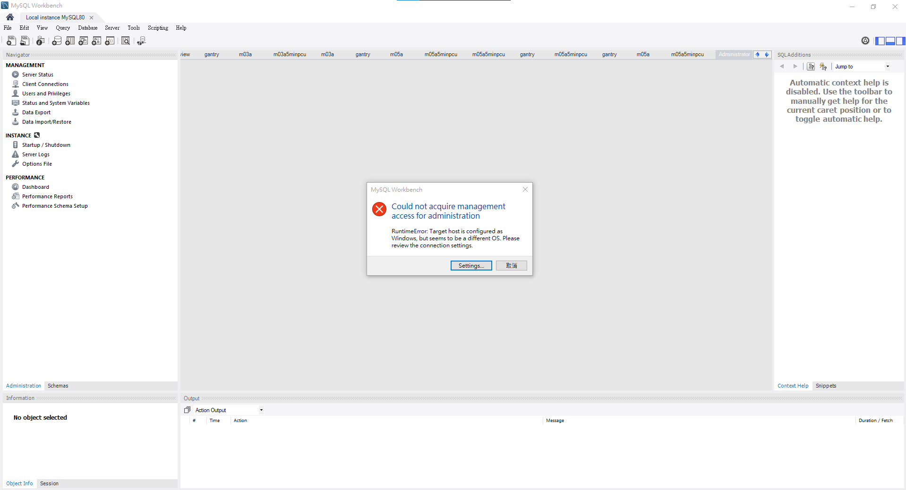
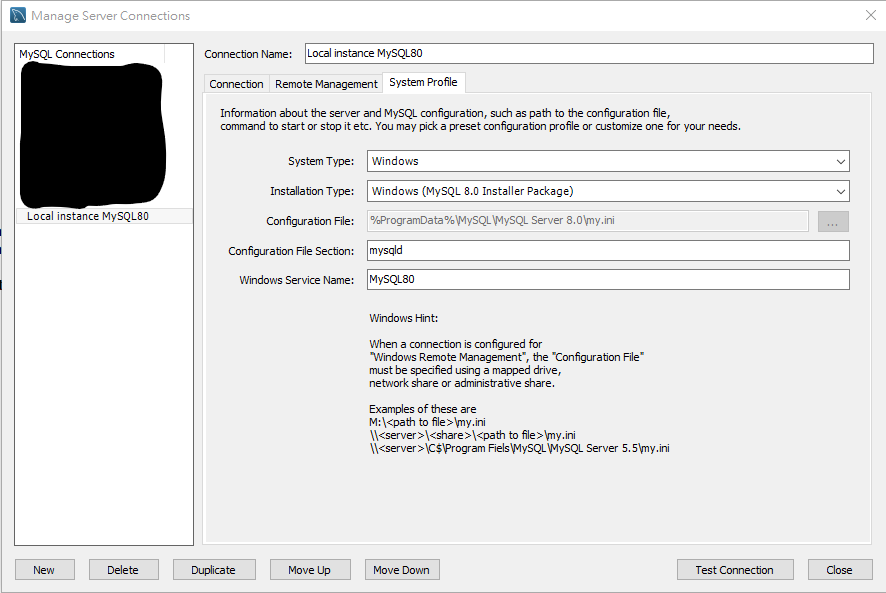

雖然以前是從 Linux 開始在玩資料庫，直接應改過的 Config 檔案也從來沒少過，但開始工作之後就越來越習慣如果有現成的工具就先用，除非真的不行才硬幹。但不知道為什麼，在我們自己 Host 的 Windows Server 跟我本機的 Workbench 儘管左側都有顯示可以設定 Instance 的 Options File 卻從來沒有成功過

問題如下，使用 MySQL 的安裝檔安裝完 MySQL Server 跟 Workbench 之後，縱使自動產生了「Local instance MySQL80」之後，只要想要點擊 Administration 頁籤中的 Instance 分類中所有功能，就會跳出錯誤視窗「Could not acquire management access for administration」


我試過改用系統管理者，無法。依照上面的說明確認過系統設定也的確是 Windows 的環境設定


就在我準備放棄決定還是手動修改 Options File 的時候突然找到這一篇[文章](https://www.zhihu.com/question/443524428)
簡單的大意來說呢，這個問題似乎是 MySQL Workbench 的 Bug，有兩個解決方式：
1. 修改系統語言，重新安裝
2. 修改 Workbench 裡面的 Python 程式

經過快速的判斷之後，我覺得後者比較可行，因此決定開始測試。
而根據這篇文章的做法，他是找到 Workbench 的安裝資料夾，並且在 workbench 資料夾中找到 os_util.py 檔案。

打開檔案之後在最後面會看到一個 Function 如下
``` python
    def exec_command(self, command, output_handler):
        """
        Executes any OS valid command and sends the output to the command listener
        Syntax:
                EXEC <command>
                
                command: A valida OS command.
        """
        retcode = 1
        try:
            # Note that self._command contains the internal command so EXEC
            # and self._args is the real OS command to be executed
            # Executes the command, reading the output from the PIPE
            process = subprocess.Popen(command, stdin = subprocess.PIPE, encoding="utf-8", stdout = subprocess.PIPE, stderr = subprocess.STDOUT, shell=True)

            # Sends all the command output to the listener
            if output_handler:
                for line in iter(process.stdout.readline, ""):
                    output_handler(line)

            # Waits for the process completion
            process.wait()
            
            retcode = process.returncode
        except Exception as exc:
            raise
            
        return retcode
```
而在知乎當中，因為他們的電腦使用的是簡體中文，因此要把這段程式碼中第十四行的「utf-8」改成gbk，而在我這邊因為電腦是以繁體中文安裝，因此要改成將「utf-8」改成「big5」（請記得中間不要加上-，我因此多卡了一陣子），然後重新開啟 Workbench，一切正常可以透過介面進行設定啦。